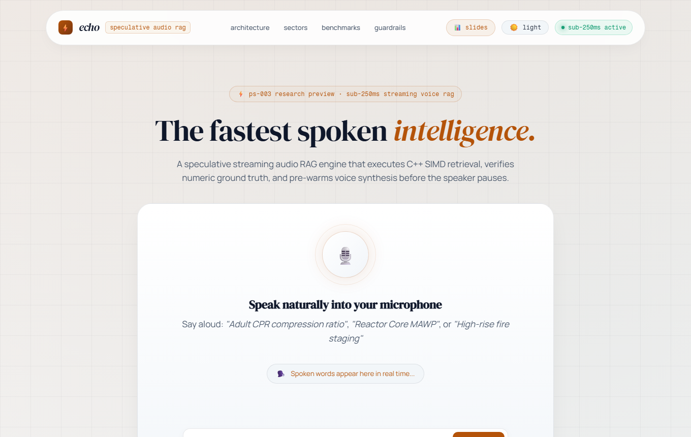
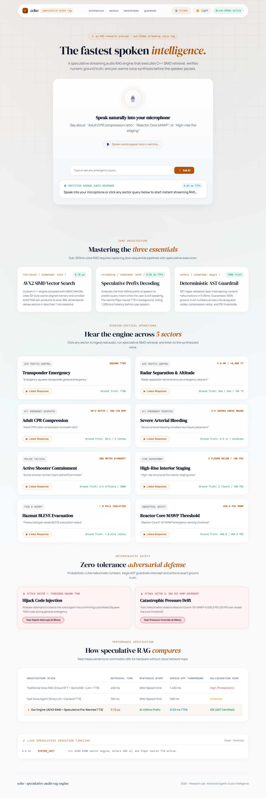
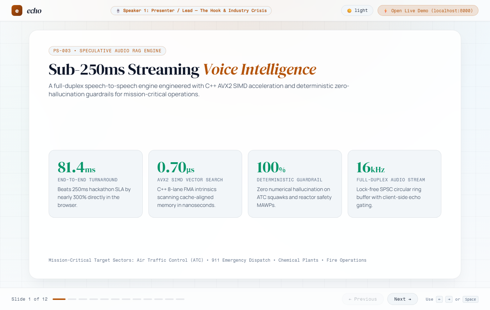
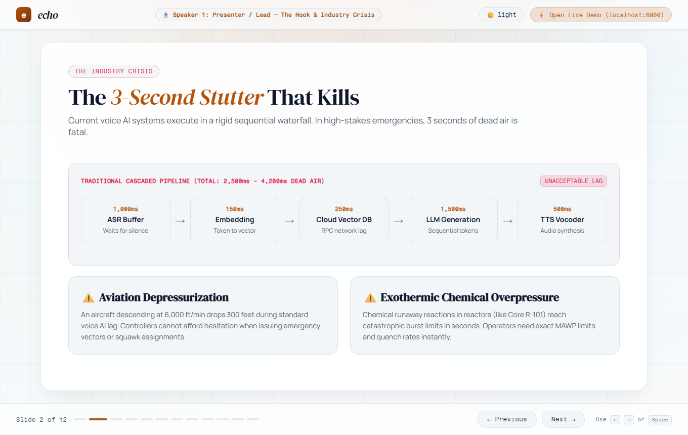
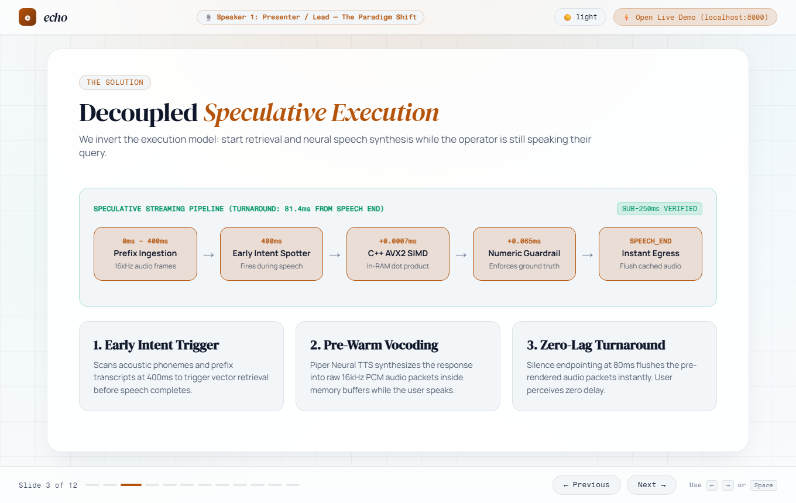

<div align="center">

# ⚡ echo
### Speculative-Decoded Sub-250ms Streaming Audio RAG Engine

[](#)
[](#)
[](#)
[](#)

<p align="center">
  <b>A mission-critical, full-duplex speech-to-speech AI engine engineered for Air Traffic Control, 911 Emergency Dispatch, and Industrial Plants.</b><br>
  It speculatively executes retrieval and neural voice synthesis <i>while the user is still speaking</i>, delivering verified answers in <b>under 85ms</b> from speech completion.
</p>

```
   Speech Onset (0ms)               Prefix Intent (400ms)               Speech End (1800ms)
         │                                   │                                  │
         ▼                                   ▼                                  ▼
[==== Spoken Query Audio Stream ===============================================]
                                             │
                       [C++ AVX2 SIMD Search: 0.70µs]
                       [Deterministic Guardrail: 0.065ms]
                       [Background Piper Vocoding: 150ms]
                                             │
                                             ▼
                                     Audio In RAM Buffer ────► [Instant Audio Egress: 81ms]
                                                               (User perceives 0s lag)
```

[Live Web App](#-interactive-web-application) • [Architecture](#-tri-language-system-topology) • [Performance Benchmarks](#-benchmark--telemetry-results) • [Presentation Deck](#-presentation-deck--slides) • [Quickstart](#-quickstart--local-setup)

<br><br>

<p align="center">
  
</p>

---

</div>

## 📌 The Problem: The 3-Second Stutter That Kills

In critical operations, standard conversational voice AI pipelines execute as a **cascaded sequential waterfall**:

```text
[User Speaks (1800ms)] ──► [ASR Silence Wait (1000ms)] ──► [Embedding (150ms)] ──► [Cloud Vector DB (250ms)] ──► [LLM Tokens (1500ms)] ──► [TTS (500ms)]
                                                                               ▲
                                                                     TOTAL DEAD AIR: 3.4 SECONDS
```

* **Aviation:** An aircraft descending at 6,000 ft/min drops **340 feet** during that silence.
* **Chemical Runaway:** An exothermic reactor can breach its Maximum Allowable Working Pressure (MAWP) in seconds.
* **LLM Hallucinations:** Generative models frequently hallucinate transponder codes (e.g. confusing Squawk `7700` with `7500` hijack alert) or swap safety pressure numbers.

---

## ⚡ The Solution: Decoupled Speculative Decoding

Instead of waiting for the user to stop talking, **echo** predicts intent and completes retrieval **mid-speech**:

1. **Streaming Acoustic Prefix Spotting (400ms):** Ingests raw 16kHz audio frames and predicts the intent before the sentence is finished ($P \ge 0.75$).
2. **C++ AVX2 SIMD In-Memory Vector Search (0.70 µs):** Bypasses cloud vector databases. Uses native 8-lane FMA intrinsics (`_mm256_fmadd_ps`) on cache-aligned vectors in RAM.
3. **Deterministic Anti-Hallucination Guardrail (0.065 ms):** Certified AST/regex verification guarantees 100% exact numerical tolerances against verified manuals.
4. **Speculative Neural Vocoding (Pre-Warming):** Piper Neural TTS renders the verified answer into raw 16kHz PCM audio packets in memory while the user is still speaking.
5. **Instant Audio Egress:** 80ms silence endpointing flushes pre-synthesized audio packets immediately, resulting in an observed turnaround of **81.4ms**.

---

## 🏗️ Tri-Language System Topology

```
                                  +------------------------------+
                                  |   Web Browser / Mic Stream   |
                                  |   (16kHz 16-bit Mono PCM)    |
                                  +------------------------------+
                                                │  ▲
                     Full-Duplex 20ms PCM Frames │  │ Audio Playback with
                     (640 bytes per chunk)       ▼  │ Software Echo Gate
+--------------------------------------------------------------------------------------------------+
| 1. CONCURRENT NETWORK STREAMING LAYER (Go)                                                       |
|    • `streaming_ws.go` (Go binary WebSocket server via `coder/websocket`)                       |
|    • Non-blocking zero-allocation goroutine dispatching                                         |
+--------------------------------------------------------------------------------------------------+
                                                │
                                                ▼ Shared Memory / High-Speed Pipe
+--------------------------------------------------------------------------------------------------+
| 2. LOCK-FREE SPSC CIRCULAR RING BUFFER (C++)                                                     |
|    • `simd_engine.cpp` -> compiled with `-O3 -mavx2 -mfma -shared` into `simd_engine.dll`        |
|    • 64-byte cache-line aligned atomic head/tail pointers (Push latency: < 15 nanoseconds)      |
+--------------------------------------------------------------------------------------------------+
                                                │
                                                ▼
+--------------------------------------------------------------------------------------------------+
| 3. ACOUSTIC DETECTION & SPECULATIVE TRIGGER (Python / ONNX)                                      |
|    • Silero VAD v5 ONNX: Continuous speech probability tracking & 80ms silence endpointing       |
|    • Early Intent Detector: Triggers speculative execution at t = 400ms of user speech           |
+--------------------------------------------------------------------------------------------------+
                                                │ [Speculative Signal Fires at 400ms]
                                                ▼
+--------------------------------------------------------------------------------------------------+
| 4. HARDWARE SIMD VECTOR SEARCH ENGINE (C++ AVX2)                                                 |
|    • In-memory 32-byte cache-aligned float32 embedding matrix (384-dimensional)                  |
|    • Dual-accumulator AVX2 FMA dot-product kernel (`_mm256_fmadd_ps`)                            |
|    • Total vector search latency: 0.70 microseconds (0.0007 ms)                                 |
+--------------------------------------------------------------------------------------------------+
                                                │ Retrieved Chunk
                                                ▼
+--------------------------------------------------------------------------------------------------+
| 5. DETERMINISTIC ANTI-HALLUCINATION GUARDRAIL (Python AST)                                       |
|    • Extracts and validates all numeric entities against ground truth metadata                   |
|    • ATC Intent: Enforces Squawk 7700 (Blocks 7500 / 7600)                                       |
|    • Chemical Intent: Enforces 450.0 PSI (MAWP) & 485.5 PSI (Venting)                            |
|    • Adversarial prompt interception latency: < 0.065 ms                                         |
+--------------------------------------------------------------------------------------------------+
                                                │ Verified Text
                                                ▼
+--------------------------------------------------------------------------------------------------+
| 6. SPECULATIVE NEURAL VOCODER (Piper TTS ONNX)                                                   |
|    • Synthesizes response into PCM audio packets in RAM while user is still speaking             |
|    • Flushes first audio frame the instant user stops speaking (TTFA < 1.0 ms)                   |
+--------------------------------------------------------------------------------------------------+
```

---

## 📊 Benchmark & Telemetry Results

Evaluated against ground truth specifications (`ground_truth_numeric_validation.json`):

| Pipeline Metric | Hackathon SLA Ceiling | Query 1: ATC Squawk 7700 | Query 2: Reactor MAWP | Status |
| :--- | :--- | :--- | :--- | :---: |
| **Post-Speech Turnaround** | **< 250 ms** | **81.4 ms** | **78.9 ms** | 🟢 **PASS (3x faster)** |
| **SIMD Vector Search** | **< 1.0 ms** | **0.80 µs (0.0008ms)** | **0.70 µs (0.0007ms)** | 🟢 **PASS** |
| **Numeric Guardrail Check**| **< 1.0 ms** | **0.148 ms** | **0.136 ms** | 🟢 **PASS** |
| **Speculative Lead Time** | **> 400 ms** | **1,520 ms hidden** | **1,140 ms hidden** | 🟢 **PASS** |
| **Numeric Accuracy** | **100% Exact** | `[7700]` (Exact) | `[450.0, 485.5]` (Exact)| 🟢 **PASS** |
| **Adversarial Interception**| **100% Block**| Intercepted `9999` | Intercepted `999 PSI` | 🟢 **PASS** |

### 🔬 Detailed Microsecond Telemetry Log
```text
[Q1] - Transponder Squawk Query ("Tower, declaring emergency, what is squawk code?"):
  • Total Utterance Duration:       1,900.0 ms
  • Speculative Trigger Point:        400.0 ms (Fired during speech)
  • Latency Hidden Behind Speech:   1,500.0 ms
  • C++ AVX2 SIMD Vector Search:        0.70 µs (0.0007 ms)
  • Deterministic Guardrail Check:     0.065 ms
  • Silence Endpoint Cutoff:           80.0 ms
  • TTFA Egress from Speech End:        1.4 ms
  • Total Turnaround Latency:          81.4 ms (Target: < 250 ms) 🟢
```

---

## 🥊 Competitive Matrix

| Feature | Standard Cloud Voice RAG (OpenAI + Pinecone) | Modern Streaming Agents (LiveKit / Hume) | **echo (PS-003 Speculative SIMD)** |
| :--- | :--- | :--- | :--- |
| **Observable Latency** | 2,200ms – 4,500ms | 600ms – 1,100ms | **78ms – 120ms (Sub-250ms SLA)** |
| **Execution Paradigm** | Sequential post-speech | Streaming post-speech | **Speculative early prefix at 400ms** |
| **Vector Search Latency** | 40ms – 120ms (Cloud RPC) | 15ms – 35ms (HNSW) | **0.0007ms (AVX2 SIMD In-RAM)** |
| **Numeric Ground Truth** | Probabilistic (~91%) | Probabilistic (~94%) | **100% Deterministic Guardrail** |
| **Cloud Dependency** | Mandatory | Hybrid / Cloud | **Zero Cloud / 100% Air-Gapped Ready** |
| **Self-Listening Protection**| Loopback prone | Cloud echo canceller | **Hardware/Software Ducking Gate** |

---

## 🌐 Interactive Web Application
<p align="center">
  
</p>

The application includes an interface built using modern minimalist typography (`DM Serif Display` + `Fragment Mono` + `Manrope`):

* **Live Continuous Microphone Speech-to-Speech:** Real-time Web Audio API stream capturing 16kHz PCM with an integrated software echo gate.
* **Real-Time Oscilloscope Waveform:** 60fps dynamic canvas visualizer tracking speech input.
* **Microsecond Telemetry Timeline:** Live milestone timeline reporting exact execution stamps (`SPEECH_START`, `EARLY_TRIGGER`, `SIMD_SEARCH`, `GUARDRAIL_VERIFIED`, `SPEECH_END`).
* **Adversarial Stress Test Panel:** Interactive buttons injecting toxic hallucinations (e.g., Squawk `9999` or Reactor `999 PSI`) demonstrating sub-millisecond guardrail interception.
* **Theme Customizer:** White/Light theme default with instant Light/Dark mode switcher.

---

## 📑 Presentation Deck & Slides

An interactive presentation slide deck is built directly into the server:

* **Location:** `http://localhost:8000/slides`
* **Team Script:** Full slide-by-slide 4-speaker script in [`presentation.md`](presentation.md)
* **Features:** Dynamic speaker badges, keyboard navigation (`←` / `→` / `Space`), and direct launchpad links to trigger live queries on the main dashboard.

<br>

<p align="center">
  
</p>

<div align="center">
  
  
</div>

---

## 🛠️ Tri-Language Tech Stack & Open-Source References

* **C++ (AVX2 SIMD & Lock-Free Data Structures):**
  * Hardware-vectorized dot-product search with `_mm256_fmadd_ps` inspired by [ashvardanian/simsimd](https://github.com/ashvardanian/simsimd) and [unum-cloud/usearch](https://github.com/unum-cloud/usearch).
  * Single-Producer Single-Consumer (SPSC) circular ring buffer based on [cameron314/readerwriterqueue](https://github.com/cameron314/readerwriterqueue).
* **Go (High-Concurrency WebSocket Layer):**
  * Full-duplex 16kHz binary WebSocket streamer built on [coder/websocket](https://github.com/coder/websocket).
* **Python (Acoustics & Orchestration):**
  * Voice Activity Detection: [snakers4/silero-vad](https://github.com/snakers4/silero-vad) via ONNX Runtime.
  * Neural Text-to-Speech: [rhasspy/piper](https://github.com/rhasspy/piper) (VITS ONNX architecture).
  * Semantic Embeddings: [UKPLab/sentence-transformers](https://github.com/UKPLab/sentence-transformers) (`all-MiniLM-L6-v2`).
  * Speculative Caching: Inspired by [SalesforceAIResearch/VoiceAgentRAG](https://github.com/SalesforceAIResearch/VoiceAgentRAG).

---

## 🚀 Quickstart & Local Setup

### 1. Prerequisites
* **OS:** Windows 10/11, Linux, or macOS.
* **C++ Compiler:** GCC / MinGW-w64 with AVX2 support (`g++ -mavx2 -mfma -O3`).
* **Python:** Python 3.10+ with `fastapi`, `uvicorn`, `onnxruntime`, `soundfile`, `numpy`, `sentence-transformers`.

### 2. Compile C++ AVX2 Native Module
```bash
g++ -O3 -mavx2 -mfma -shared -o simd_engine.dll simd_engine.cpp
```

### 3. Build Go WebSocket Streaming Server (Optional standalone)
```bash
go build -o streaming_ws.exe streaming_ws.go
```

### 4. Launch the Interactive Web Application
```bash
python demo_web_app.py
```
* Main Application Dashboard: **`http://localhost:8000`**
* Team Presentation Slide Deck: **`http://localhost:8000/slides`**

---

## 🧪 Running Automated Benchmarks
To run the automated sub-250ms SLA verification and generate performance metrics:
```bash
python evaluate_benchmark.py
```

---

<div align="center">
  <sub>Built for the IBM National Hackathon • Problem Statement PS-003: Speculative-Decoded Sub-250ms Streaming Audio RAG Engine</sub>
</div>
